# Creative Technologist Personal Website
## Development Planning Document

**Date:** December 17, 2025  
**Author:** Your Name  
**Platform:** Next.js 14 (App Router) + Firebase Hosting + Cursor AI  
**Status:** Ready for Development

---

## 1. Project Overview

### Goal
Build a personal portfolio and thought leadership site for a creative technologist working in immersive experiences, location-based entertainment, and emerging tech. The site serves as:
- A digital storefront showcasing work, ideas, and availability
- A platform for sharing experiments and thought leadership
- A professional CV with a visual, engaging timeline
- A contact and booking gateway with gated availability access

### Key Features
- ✅ Multi-page portfolio with CMS flexibility
- ✅ Experiments showcase (grid + detail pages)
- ✅ Articles / Musings with thought leadership voice
- ✅ Experience timeline (visual infographic)
- ✅ Service cards and positioning clarity
- ✅ Contact form with backend notification
- ✅ Private, token-gated availability calendar view
- ✅ Fast, SEO-friendly, mobile-responsive

### Tech Stack
| Layer | Technology | Why |
|-------|-----------|-----|
| **Frontend** | Next.js 14 (App Router) + React + TypeScript | Fast dev in Cursor, SSR, Firebase-native, great DX |
| **Styling** | Tailwind CSS + shadcn/ui | Cursor-friendly, rapid component building, accessible |
| **Content** | MDX + Markdown (articles/experiments) + Firestore (metadata) | Git-tracked, easy to edit, flexible |
| **Hosting** | Firebase Hosting | Built-in Next.js integration, serverless, free tier sufficient |
| **Backend** | Firebase Cloud Functions | Auto-wired to Next.js, handles forms, token logic, email |
| **Database** | Firestore | Real-time, simple, easy to manage content + tokens |
| **Scheduling** | Cal.com or Calendly (embedded) | Clean integration, professional UX |
| **Email** | SendGrid or Mailgun | Transactional form notifications |

---

## 2. Project Structure

```
creative-tech-site/
├── app/
│   ├── layout.tsx                 # Root layout + nav
│   ├── page.tsx                   # Home / landing
│   ├── about/
│   │   └── page.tsx               # About & services
│   ├── experiments/
│   │   ├── page.tsx               # Experiments grid
│   │   └── [slug]/
│   │       └── page.tsx           # Experiment detail
│   ├── articles/
│   │   ├── page.tsx               # Articles list
│   │   └── [slug]/
│   │       └── page.tsx           # Article detail
│   ├── experience/
│   │   └── page.tsx               # Timeline & CV
│   ├── tools/
│   │   └── page.tsx               # Tools & resources
│   ├── contact/
│   │   └── page.tsx               # Contact form
│   ├── availability/
│   │   └── [token]/
│   │       └── page.tsx           # Gated calendar view
│   ├── api/
│   │   ├── contact/
│   │   │   └── route.ts           # POST contact form
│   │   ├── validate-token/
│   │   │   └── route.ts           # Check availability token
│   │   └── experiments/
│   │       └── route.ts           # Fetch experiments metadata
│
├── components/
│   ├── layout/
│   │   ├── Header.tsx             # Nav bar
│   │   ├── Footer.tsx             # Footer
│   │   └── Container.tsx          # Max-width wrapper
│   ├── sections/
│   │   ├── Hero.tsx               # Home hero
│   │   ├── ServiceCards.tsx       # 3-4 service cards
│   │   ├── FeaturedExperiments.tsx # Featured experiments grid
│   │   ├── LatestArticles.tsx      # Latest articles preview
│   │   ├── ExperienceSnapshot.tsx  # Timeline snapshot
│   │   └── ContactForm.tsx        # Contact form
│   ├── ui/
│   │   ├── Button.tsx             # Reusable button
│   │   ├── Card.tsx               # Reusable card
│   │   ├── Badge.tsx              # Tag / label component
│   │   └── Timeline.tsx           # Timeline component
│   └── embeds/
│       └── CalendarEmbed.tsx      # Cal.com / Calendly embed
│
├── content/
│   ├── experiments/
│   │   ├── experiment-01.mdx      # Experiment write-up
│   │   ├── experiment-02.mdx
│   │   └── ...
│   ├── articles/
│   │   ├── article-01.mdx         # Article / musing
│   │   ├── article-02.mdx
│   │   └── ...
│   └── experience.ts              # Timeline & projects data
│
├── lib/
│   ├── firestore.ts               # Firestore initialization & helpers
│   ├── content.ts                 # MDX / content loading
│   ├── types.ts                   # TypeScript interfaces
│   └── utils.ts                   # General utilities
│
├── styles/
│   └── globals.css                # Tailwind directives
│
├── public/
│   ├── images/                    # Hero images, logos, etc.
│   └── ...
│
├── firebase.json                  # Firebase Hosting config
├── next.config.js                 # Next.js config
├── tailwind.config.js             # Tailwind config
├── tsconfig.json                  # TypeScript config
├── .env.local                     # Local env vars (Firebase keys, etc.)
└── package.json                   # Dependencies

```

---

## 3. Wireframe & Page Layout

### Home / Landing (`/`)
- **Hero Section**
  - Left (2/3): Heading + subheading + two CTAs
  - Right (1/3): Portrait + tagline
- **Service Cards** (4 columns)
  - Discovery & Feasibility
  - Creative Technology Direction
  - Technical Project Management
  - R&D & Prototyping
- **Featured Experiments** (3 tiles)
  - Grid of latest 3 experiments with thumbnail, title, tags
- **Latest Articles** (2–3 cards)
  - Preview of latest articles
- **Experience Snapshot**
  - Left: paragraph about 13+ years
  - Right: mini timeline with 4 phases + "View Full Timeline" link
- **Footer** (persistent)
  - Links + LinkedIn + Email

### About & Services (`/about`)
- Intro block (2–3 paragraphs)
- **Service Cards** (expanded from home)
  - Each card opens into more detail: types of engagement, typical duration, who it's for
- **How I Work** principles (3–4 bullet points)
- Footer

### Shared Experiments (`/experiments`)
- Header + intro text
- **Filter bar** (optional): All · AI · Interaction · IoT · Data · Tools
- **Experiment grid** (2–3 cards per row)
  - Thumbnail, title, 1-line purpose, tags, "View" link
- Pagination or "Load more" if many experiments

### Experiment Detail (`/experiments/[slug]`)
- Title + meta (date, tags)
- **Brief** section
- **What I Made** section (screenshots, description)
- **How It Works** section (stack, hardware, software)
- **What I'd Do with This for Clients** section
- Back link to experiments grid
- Related experiments (2–3 cards)

### Articles (`/articles`)
- Header + intro text
- **Article list** (vertical)
  - Title (link), 2–3 line summary, tags, date
  - Optional filter: Thought Leadership · Process · Tools

### Article Detail (`/articles/[slug]`)
- Title + date + tags
- Body content (rendered MDX)
- Back link to articles list
- Related articles

### Experience & Timeline (`/experience`)
- Header + disclaimer
- **High-level timeline** (4 phases)
  - Each phase: name, date range, key employers/highlights
- **Selected projects** (by year, newest first)
  - Year subheading
  - Bullet per project: [Project] | Role | Company | 1-line what
- Optional: "More details" modal/link for flagship projects

### Tools & Resources (`/tools`)
- Header
- **Tool stack** (grid or list)
  - Icon/name + 1-line how you use it
- **Utilities / Frameworks** (if any)
  - Cards for scripts, templates, with links

### Contact (`/contact`)
- Header
- Left: short copy about best projects for you
- Right: contact form (Name, Email, Org, Brief, Timing/Budget dropdown)
- **Availability note**
  - "If we're in conversation, I can share a live availability view."
- No open calendar (just note + link to request)

### Private Availability (`/availability/[token]`)
- Validates token from Firestore in a server component
- If valid: displays embedded Cal.com / Calendly booking widget
- If invalid or expired: displays 404 or "Link expired, contact me" message

---

## 4. Firestore Data Model

### Collections

#### `experiments`
```
experiments/
  experiment-001/
    {
      slug: "ai-sensor-interaction",
      title: "AI-Driven Sensor Interaction Prototype",
      excerpt: "Exploring real-time gesture recognition...",
      content: "... body (or stored in MDX file)",
      tags: ["AI", "IoT", "Interaction"],
      thumbnail: "https://...",
      createdAt: timestamp,
      featured: true
    }
  ...
```

#### `articles`
```
articles/
  article-001/
    {
      slug: "on-inevitability-and-choice",
      title: "On Inevitability and Choice in AI Futures",
      excerpt: "Thoughts on building alternative futures...",
      content: "... body (or stored in MDX file)",
      tags: ["Thought Leadership", "AI Futures"],
      publishedAt: timestamp,
      featured: true
    }
  ...
```

#### `availabilityTokens`
```
availabilityTokens/
  token-abc123/
    {
      token: "abc123-secure-random-string",
      createdAt: timestamp,
      expiresAt: timestamp,
      calendarUrl: "https://cal.com/yourname/meeting",
      isActive: true,
      generatedFor: "Client Name or 'General'" (optional)
    }
  ...
```

#### `contactSubmissions` (form responses)
```
contactSubmissions/
  submission-001/
    {
      name: "Jane Doe",
      email: "jane@example.com",
      organisation: "Design Studio XYZ",
      brief: "We want to build an interactive installation...",
      timing: "Q1 2026",
      budget: "£50k–£100k",
      submittedAt: timestamp,
      read: false
    }
  ...
```

---

## 5. Key Implementation Tasks

### Phase 1: Core Setup (Days 1–2)
- [ ] **Initialize Next.js project**
  - `npx create-next-app@latest creative-site --typescript --tailwind`
  - Install: `next-mdx-remote`, `gray-matter`, `@firebase/app`, `@firebase/firestore`, `@firebase/auth`

- [ ] **Set up Firebase project**
  - Create Firebase project in console
  - Enable Firestore, Storage, Cloud Functions
  - Create `.env.local` with Firebase keys
  - Initialize Firestore client in `lib/firestore.ts`

- [ ] **Set up Tailwind & shadcn/ui**
  - Initialize shadcn: `npx shadcn-ui@latest init`
  - Configure Tailwind in `tailwind.config.js`

- [ ] **Create root layout & navigation**
  - Build `app/layout.tsx` with persistent header + footer
  - Create `components/layout/Header.tsx` (nav links + branding)
  - Create `components/layout/Footer.tsx`

### Phase 2: Homepage & Service Cards (Days 2–3)
- [ ] **Build Home page (`app/page.tsx`)**
  - Import and compose sections

- [ ] **Create Hero component**
  - `components/sections/Hero.tsx`
  - Responsive layout (left text, right image/graphic)

- [ ] **Create ServiceCards component**
  - `components/sections/ServiceCards.tsx`
  - 4 cards with titles, descriptions, optional "Learn more" link

- [ ] **Create FeaturedExperiments component**
  - `components/sections/FeaturedExperiments.tsx`
  - Fetch 3 featured experiments from Firestore or array

- [ ] **Create LatestArticles component**
  - `components/sections/LatestArticles.tsx`
  - Fetch latest 2–3 articles from Firestore

- [ ] **Create ExperienceSnapshot component**
  - `components/sections/ExperienceSnapshot.tsx`
  - Mini timeline (4 phases) + link to full timeline

### Phase 3: Content Pages (Days 4–5)
- [ ] **About page (`app/about/page.tsx`)**
  - Static intro + expanded service cards + principles

- [ ] **Experiments page & detail**
  - `app/experiments/page.tsx` (grid + optional filter)
  - `app/experiments/[slug]/page.tsx` (detail page)
  - Load MDX files from `content/experiments/` or fetch from Firestore

- [ ] **Articles page & detail**
  - `app/articles/page.tsx` (list)
  - `app/articles/[slug]/page.tsx` (detail)
  - Load MDX files from `content/articles/` or fetch from Firestore

- [ ] **Experience & Timeline page**
  - `app/experience/page.tsx`
  - Create `components/ui/Timeline.tsx` (visual timeline component)
  - Use static data from `content/experience.ts` or Firestore

- [ ] **Tools page**
  - `app/tools/page.tsx`
  - Static list of tools + descriptions

### Phase 4: Contact & Backend (Days 5–6)
- [ ] **Contact page & form**
  - `app/contact/page.tsx`
  - `components/sections/ContactForm.tsx` (React form component)
  - Form validation (client-side + server-side)

- [ ] **Contact API route**
  - `app/api/contact/route.ts` (POST handler)
  - Validate request
  - Store in Firestore
  - Send email via SendGrid / Mailgun
  - Return success response

- [ ] **Create availability token helper**
  - Cloud Function or API route to generate short-lived tokens
  - Store in Firestore with expiry

### Phase 5: Gated Availability & Calendar (Days 6–7)
- [ ] **Availability validation**
  - `app/api/validate-token/route.ts` (GET handler)
  - Check token in Firestore, return calendar URL if valid

- [ ] **Private availability page**
  - `app/availability/[token]/page.tsx`
  - Server component to fetch & validate token
  - If valid, render embedded Cal.com / Calendly widget
  - If invalid, show 404 or "Link expired"

- [ ] **Calendar embed component**
  - `components/embeds/CalendarEmbed.tsx`
  - Embed Cal.com script or Calendly react widget

### Phase 6: Polish & Deployment (Days 7–8)
- [ ] **SEO & metadata**
  - Add `metadata` export to pages
  - Create `sitemap.xml`
  - Add Open Graph images

- [ ] **Mobile responsiveness**
  - Test all pages on mobile (Tailwind responsive classes)

- [ ] **Performance**
  - Image optimization (Next.js `<Image>` component)
  - Lazy loading for components

- [ ] **Firebase Hosting setup**
  - Run `firebase init hosting` with Next.js framework
  - Configure `firebase.json`
  - Test locally with `firebase serve`

- [ ] **Deploy to Firebase**
  - Push to GitHub (optional: set up GitHub Actions for auto-deploy)
  - Deploy: `firebase deploy`

- [ ] **Domain & DNS**
  - Point custom domain to Firebase Hosting via DNS settings

---

## 6. Cursor AI Prompts & Instructions

### Setup Prompt (Paste into Cursor)

```
I'm building a personal portfolio website for a creative technologist. Here's what I need:

## Tech Stack
- Next.js 14 (App Router)
- React + TypeScript
- Tailwind CSS + shadcn/ui
- Firebase Hosting + Firestore
- MDX for content (articles & experiments)

## Project Structure
I've provided a detailed project structure with the following directories:
- `app/` - Next.js pages & API routes
- `components/` - React components (layout, sections, UI, embeds)
- `content/` - MDX files for articles & experiments, plus experience data
- `lib/` - Firestore helpers, content loading, types, utilities
- `public/` - Images & static assets
- `styles/` - Tailwind globals

## What I Need First
1. Scaffold the project directory structure
2. Initialize Firebase client in `lib/firestore.ts` with full CRUD helpers for experiments, articles, and availabilityTokens
3. Create the root layout (`app/layout.tsx`) with a sticky header, persistent footer, and Tailwind base styles
4. Create a reusable `components/layout/Header.tsx` with navigation links
5. Create a reusable `components/layout/Footer.tsx` with contact links
6. Set up types in `lib/types.ts` for Experiment, Article, AvailabilityToken, ContactSubmission

## Design System
- Use Tailwind CSS for all styling
- Use shadcn/ui for pre-built components (Button, Card, Badge)
- Color palette: modern, accessible, professional
- Typography: Geist or system font stack, generous spacing
- Mobile-first responsive design

## Pages to Build
1. Home (`/`) - Hero + Service Cards + Featured Experiments + Latest Articles + Experience Snapshot
2. About (`/about`) - Intro + Expanded Service Cards + How I Work principles
3. Experiments (`/experiments`) - Grid of experiments with filter + Detail page (`/experiments/[slug]`)
4. Articles (`/articles`) - List of articles + Detail page (`/articles/[slug]`)
5. Experience (`/experience`) - Timeline infographic + Selected projects list
6. Tools (`/tools`) - Tools & resources
7. Contact (`/contact`) - Contact form
8. Availability (`/availability/[token]`) - Gated calendar view with token validation

## Content Sources
- Experiments & Articles: MDX files in `content/` directory (front matter for metadata)
- Experience: Static data in `content/experience.ts`
- Projects: Firestore collection (fetch at build time or via API)

## Key Features
- Fast, SEO-friendly, mobile-responsive
- MDX support for rich content
- Firestore for dynamic content & token management
- Contact form with backend validation & email notification
- Private, token-gated availability calendar (Cal.com or Calendly embed)
- Tagging & filtering on experiments & articles

## Positioning
I'm a creative technologist specializing in the "in-between" space:
- Between creative concept and technical production
- Between project management and hands-on prototyping
- Between software and hardware integration

My tone: calm, grounded, collaborative, pragmatic. No ego—focus on team, systems, de-risking.

Please scaffold the full project structure, initialize Firebase, and build the core layout & navigation first. I'll then ask you to build individual pages section by section.
```

### Page-by-Page Prompts

**Once core setup is done, use prompts like:**

```
Build the Home page (`app/page.tsx`) with the following sections:
1. Hero section (left 2/3 text, right 1/3 portrait + tagline)
2. Service cards (4 cards: Discovery & Feasibility, Creative Technology Direction, Technical Project Management, R&D & Prototyping)
3. Featured experiments (grid of 3, fetch from Firestore collection `experiments` where featured == true)
4. Latest articles (2–3 article cards, fetch from Firestore collection `articles`, ordered by publishedAt desc)
5. Experience snapshot (left paragraph about 13+ years, right mini timeline with 4 phases)

Use Tailwind for responsive layout. Use shadcn Button & Card components. Make sure it's mobile-friendly.
```

```
Build the Experiments grid page (`app/experiments/page.tsx`) and detail page (`app/experiments/[slug]/page.tsx`):
- Grid page: fetch all experiments from Firestore, display as 2–3 columns, each with thumbnail, title, excerpt, tags
- Add optional filter bar (All, AI, Interaction, IoT, Data, Tools)
- Detail page: fetch experiment by slug, display full MDX content, add "Related experiments" section

Use MDX with front matter for metadata (title, tags, excerpt, thumbnail, etc.).
```

```
Create the contact form component (`components/sections/ContactForm.tsx`) and API route (`app/api/contact/route.ts`):
- Form fields: Name, Email, Organisation, Brief (textarea), Timing (select: ASAP, Q1 2026, TBD), Budget (select: <£25k, £25-50k, £50-100k, £100k+)
- Client-side validation with error messages
- Submit to POST `/api/contact`
- API route: validate, store in Firestore `contactSubmissions`, send email via SendGrid, return success response
- On success, show "Thanks for reaching out" message
```

```
Build the gated availability page (`app/availability/[token]/page.tsx`):
- Server component that validates the [token] from Firestore in `availabilityTokens` collection
- Check: token exists, isActive == true, expiresAt > now
- If valid: render embedded Cal.com booking widget (with calendarUrl from Firestore)
- If invalid: render 404 or "This link has expired. Please contact me to request a new one."
- Use Next.js server component + Firestore SDK for secure token validation
```

---

## 7. Deployment Checklist

- [ ] Set `.env.local` with Firebase config
- [ ] Test locally: `npm run dev`
- [ ] Build locally: `npm run build`
- [ ] Run `firebase init hosting` → select Next.js framework
- [ ] Test with Firebase emulator: `firebase serve`
- [ ] Verify all pages load
- [ ] Test contact form submission
- [ ] Test token generation & availability page
- [ ] Check mobile responsiveness
- [ ] Verify SEO metadata
- [ ] Run Lighthouse audit (aim for 90+)
- [ ] Deploy: `firebase deploy`
- [ ] Test live deployment
- [ ] Set up custom domain DNS
- [ ] Set up email notifications in Firebase (or SendGrid webhook for form submissions)

---

## 8. Tech Stack Diagram (Mermaid)

```mermaid
flowchart TD

    User[User / Visitor] -->|Browser| Browser[Modern Browser]

    subgraph Frontend["Frontend: Next.js + React + TypeScript"]
        Browser --> NextApp[Next.js App Router\nReact & TypeScript]
        NextApp --> UI[UI Components\nTailwind CSS & shadcn/ui]

        subgraph Pages["Core Pages / Wireframe"]
            Home[Home / Landing\nHero · Services · Featured Experiments · Latest Articles]
            About[About & Services]
            Experiments[Shared Experiments\nGrid & Detail]
            Articles[Articles & Musings\nList & Detail]
            Experience[Experience & Timeline\nInteractive CV]
            Tools[Tools & Resources]
            Contact[Contact\nForm & Availability Info]
            Availability[Private Availability View\nAvailability Route]
        end

        NextApp --> Pages
        Pages --> UI
    end

    subgraph Firebase["Firebase: Hosting & Backend"]
        Hosting[Firebase Hosting\nStatic Assets & SSR]
        CF[Cloud Functions\nServer Logic & APIs]
        FS[Firestore\nContent & Tokens]
        Auth[Firebase Auth\nOptional]
    end

    NextApp -->|Deployed to| Hosting
    Hosting --> CF
    CF --> FS
    CF --> Auth

    subgraph Content["Content Sources"]
        MDX[MDX / Markdown\nArticles & Experiments]
        CMSData[Firestore Collections\nMetadata, Projects, Tags]
    end

    MDX --> NextApp
    CMSData --> FS

    subgraph Scheduling["Scheduling Provider"]
        Cal[Cal.com or Calendly\nBooking Page / Embed]
    end

    Availability --> CF
    CF --> FS
    Availability -->|If token valid| Cal

    subgraph ContactFlow["Contact & Notifications"]
        ContactForm[Contact Form\nReact Component]
        ContactFn[Cloud Function\nValidate · Store · Notify]
        EmailSvc[Email Provider\nSendGrid or Similar]
    end

    Contact --> ContactForm
    ContactForm --> ContactFn
    ContactFn --> FS
    ContactFn --> EmailSvc

    Home -->|Service cards| About
    Home -->|Featured experiments| Experiments
    Home -->|Latest articles| Articles
    Home -->|Experience snapshot| Experience
    Contact -->|Request availability link| Availability
```



---

## 9. File Checklist

**Core Configuration:**
- [ ] `package.json` - Dependencies, scripts
- [ ] `tsconfig.json` - TypeScript config
- [ ] `next.config.js` - Next.js config (MDX plugin)
- [ ] `tailwind.config.js` - Tailwind config
- [ ] `.env.local` - Firebase keys (not checked in)
- [ ] `.gitignore` - Ignore node_modules, env, etc.
- [ ] `firebase.json` - Firebase Hosting config

**App Structure:**
- [ ] `app/layout.tsx` - Root layout
- [ ] `app/page.tsx` - Home
- [ ] `app/about/page.tsx` - About
- [ ] `app/experiments/page.tsx` - Experiments list
- [ ] `app/experiments/[slug]/page.tsx` - Experiment detail
- [ ] `app/articles/page.tsx` - Articles list
- [ ] `app/articles/[slug]/page.tsx` - Article detail
- [ ] `app/experience/page.tsx` - Timeline & CV
- [ ] `app/tools/page.tsx` - Tools
- [ ] `app/contact/page.tsx` - Contact
- [ ] `app/availability/[token]/page.tsx` - Gated availability
- [ ] `app/api/contact/route.ts` - Contact form API
- [ ] `app/api/validate-token/route.ts` - Token validation API

**Components:**
- [ ] `components/layout/Header.tsx` - Nav bar
- [ ] `components/layout/Footer.tsx` - Footer
- [ ] `components/sections/Hero.tsx` - Home hero
- [ ] `components/sections/ServiceCards.tsx` - 4 service cards
- [ ] `components/sections/FeaturedExperiments.tsx` - Featured grid
- [ ] `components/sections/LatestArticles.tsx` - Latest articles
- [ ] `components/sections/ExperienceSnapshot.tsx` - Timeline snapshot
- [ ] `components/sections/ContactForm.tsx` - Contact form
- [ ] `components/ui/Button.tsx` - Button (shadcn)
- [ ] `components/ui/Card.tsx` - Card (shadcn)
- [ ] `components/ui/Badge.tsx` - Badge (shadcn)
- [ ] `components/ui/Timeline.tsx` - Timeline component
- [ ] `components/embeds/CalendarEmbed.tsx` - Cal.com/Calendly embed

**Content & Lib:**
- [ ] `lib/firestore.ts` - Firebase init & helpers
- [ ] `lib/content.ts` - MDX loading & parsing
- [ ] `lib/types.ts` - TypeScript interfaces
- [ ] `lib/utils.ts` - General utilities
- [ ] `content/experience.ts` - Experience & projects data
- [ ] `content/experiments/` - MDX experiment files
- [ ] `content/articles/` - MDX article files

**Styling:**
- [ ] `styles/globals.css` - Tailwind directives

**Public Assets:**
- [ ] `public/images/` - Hero images, portraits, icons

---

## 10. Next Steps

1. **Copy the "Setup Prompt"** above and paste it into Cursor with your project context.
2. **Let Cursor scaffold the project structure** and initialize Firebase, types, and core layout.
3. **Follow the "Page-by-Page Prompts"** once core setup is done, building one page at a time.
4. **Create content files** (MDX experiments & articles) in `content/` as you go.
5. **Test locally** and iterate with Cursor until you're happy with the design and functionality.
6. **Deploy to Firebase** once ready, following the deployment checklist.

---

## 10b. Implementation Progress (local dev snapshot)

- **Core layout & styling**
  - `app/layout.tsx` implemented with sticky header, footer, and a dark, type-led shell.
  - Global styles live in `app/globals.css`; several sections now use inline styles tuned to a Toolbar/Framer-inspired aesthetic.
- **Navigation & layout components**
  - `components/layout/Header.tsx`, `Footer.tsx`, and `Container.tsx` are in place and used across pages.
- **Home page composition**
  - `Hero`, `ServiceCards`, `FeaturedExperiments`, `LatestArticles`, and `ExperienceSnapshot` exist under `components/sections/` and are composed in `app/page.tsx`.
- **Articles & experiments**
  - Article and experiment list/detail pages have been created and wired to MDX content files under `content/articles` and `content/experiments`.
- **Contact & availability**
  - `ContactForm` section and `app/api/contact/route.ts` are implemented with validation and SendGrid email support (Firestore persistence helpers were removed in the latest iteration and must be reintroduced when backend work resumes).
  - Gated availability page under `app/availability/[token]/page.tsx` renders an embedded booking widget when provided a valid token.
- **3D carousel experiment**
  - `components/ui/carousel-3d.tsx` and `components/sections/Carousel3DSection.tsx` implement a 3D image carousel:
    - Tiles orbit in 3D using `translate3d` but always face the viewer (no per-tile rotation).
    - Rotation direction is controlled by cursor position (left = clockwise, right = counter‑clockwise).
    - Hovering the front-most tile pauses rotation and shows a dark popup with title/description; moving left/right or leaving the tile resumes rotation.
- **Backend helpers status**
  - `lib/types.ts` and `lib/utils.ts` are present.
  - `lib/firestore.ts` and `lib/content.ts` were deleted during recent refactors; they need to be rebuilt following the Firestore and MDX model described in section 4 before reconnecting dynamic content and contact/availability storage.

> Future models: treat this section as the canonical snapshot of what’s already implemented versus what remains from the original plan. Update it whenever you make structural changes (new pages, deleted libs, major styling shifts, etc.).

---

## 11. Useful Resources

- **Next.js + Firebase Integration:** https://firebase.google.com/docs/hosting/frameworks/nextjs
- **Next.js MDX Setup:** https://nextjs.org/docs/app/building-your-application/configuring/mdx
- **Firestore Web SDK:** https://firebase.google.com/docs/firestore/quickstart
- **shadcn/ui Components:** https://ui.shadcn.com/
- **Tailwind CSS:** https://tailwindcss.com/docs
- **Cal.com Embed:** https://cal.com/integrate
- **Calendly React:** https://www.npmjs.com/package/react-calendly
- **Firebase CLI:** https://firebase.google.com/docs/cli

---

## Questions or Customizations?

If you need to adapt any section (e.g., different scheduling provider, change content model, add analytics), simply ask Cursor directly or modify the prompts above to fit your needs.

Good luck building! 🚀
